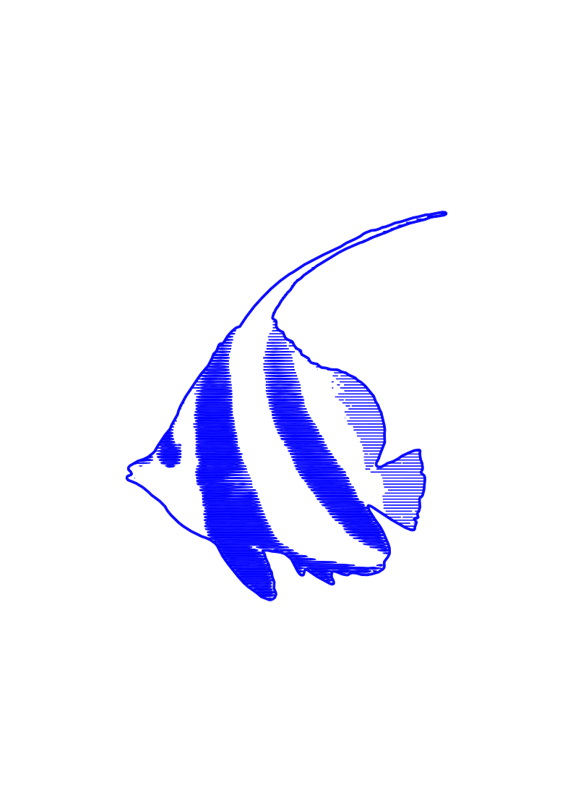
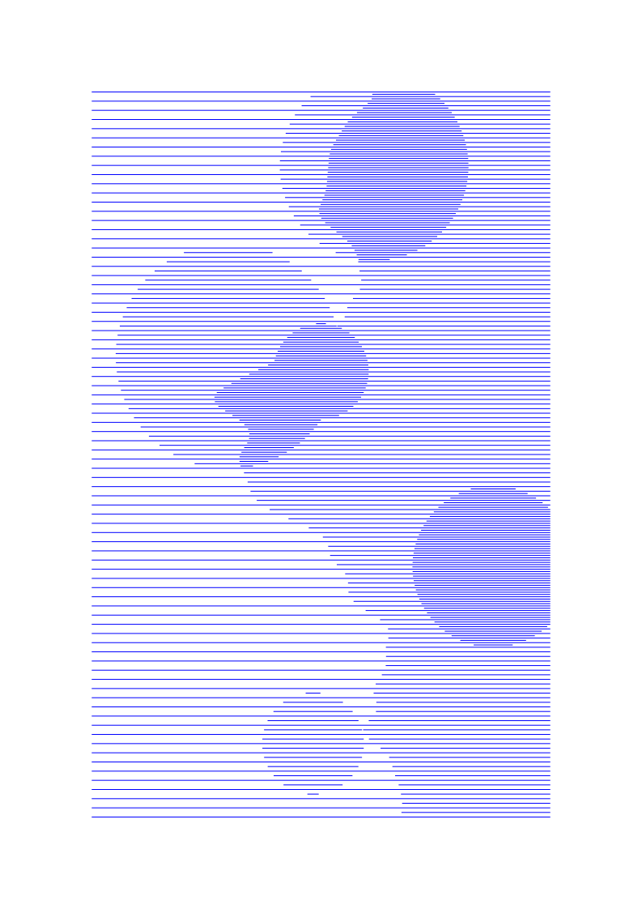
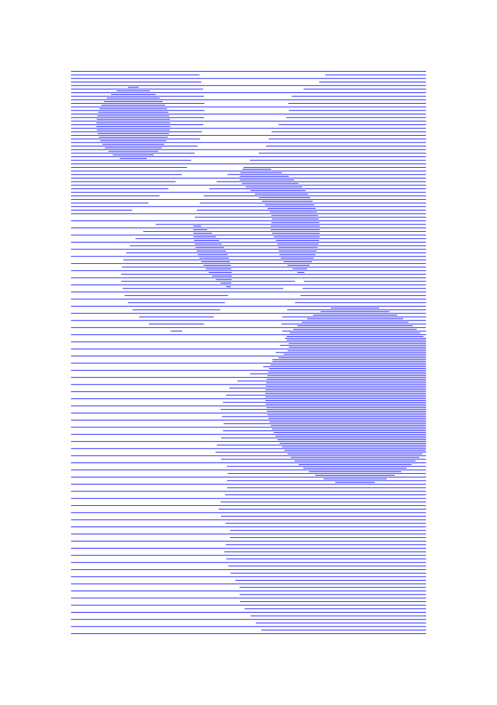
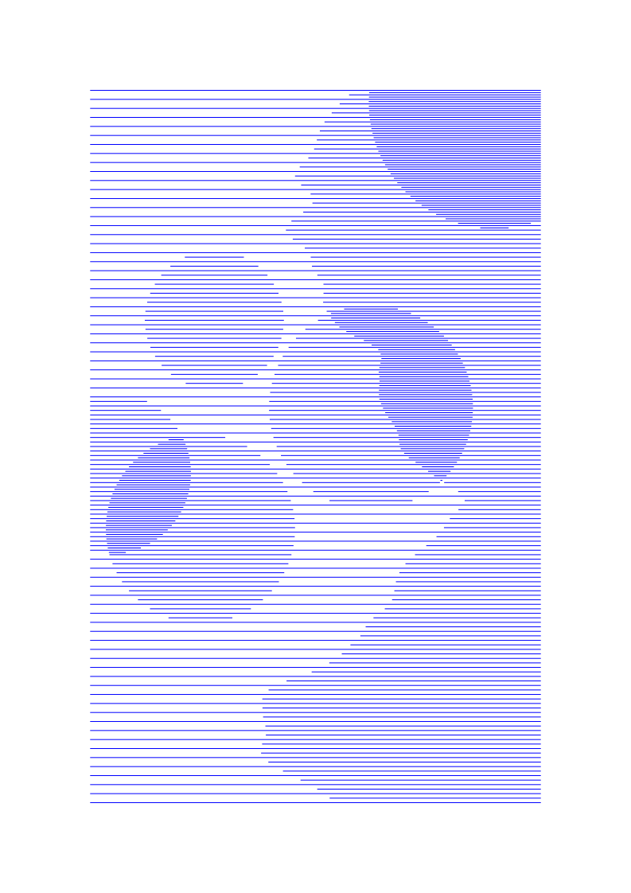

# sketches

My collection of personal plotter generative art sketches made with [vsketch](https://github.com/abey79/vsketch). Most can be run and interacted with using the following command:

```bash
$ vsk run hline
```

Some additional dependencies might be needed, including but not limited to:
- [vpype-explorations](https://github.com/abey79/vpype-explorations)
- [hatched](https://github.com/abey79/hatched)
- [vpype-text](https://github.com/abey79/vpype-text)

Though I wrote it, note that this code doesn't necessarily match my standards :)

The code is available under the MIT license and the artworks under [CC BY-NC-SA 4.0](https://creativecommons.org/licenses/by-nc-sa/4.0/). 

---
### `snowflake`

A quick-and-dirty snowflake generator for Xmas giftwrap decoration.


---
### `world`

Rotating earth, 280-frame loop I made to illustrate my [article](https://bylr.info/articles/2022/12/22/automatic-plotloop-machine/) on the Automatic #plotloop Machine.

Here is a video of the process:

[](https://www.youtube.com/watch?v=w_PPPImmEN8)

And the resulting loop:


---
### `warp`

Hyperspace jump, 200-frame loop made automatically with a couple of Raspberry Pi, some LEGOs and a [Doit](https://pydoit.org) script.

Highly compressed/dithered, 40-fps GIF:


Other versions:
- Uncompressed 4-fps GIF [here](https://raw.githubusercontent.com/abey79/sketches/master/warp/output/warp.gif).
- YouTube version at the intended 120 fps [here](https://www.youtube.com/shorts/hSoPIU3s5DE).

---
### `fill_test`


Details [here](https://bylr.info/articles/2022/04/28/sketch-fill-test/).

---
### `machine_typography`

17 letters for 17 recipients. This is my winter '21-'22 [`#ptpx`](https://twitter.com/search?q=%23ptpx) contribution.


 


---

### `postcard`

Helper sketch to create postcards with addresses and a custom message. Very useful for `#ptpx`.

Instructions:

1) Create the following files next to the sketch script:
- `addresses.txt`: all the addresses, separated by two new lines
- `header.txt`: header text (typically, your address)
- `message.txt`: postcard message, may contain $FirstName$, which will be replaced as you expect
2) Run the sketch: `vsk run postcard`
3) Adjust the parameters and your message until everything looks good, then save a configuration (`my_config`)
4) Export all SVGs: `vsk save --config my_config --param addr_id 0..8 postcard` (adjust the address ID range as needed)


---
### `liquid_neon`

Small experiment which combined the `neon` [module sets](https://github.com/abey79/vpype-explorations/blob/master/vpype_explorations/moduleset.py) with some deformation filter that would eventually become the [`squiggles` command](https://vpype.readthedocs.io/en/stable/reference.html#squiggles).


---
### `drift_poly`

My design for early 2021 `#ptpx`. The config for the 9 cards I made are included in the repo.


---
### `dots`

Just a bunch of dots drawn with `vsk.point()` on a regular grid. Sometime they are skipped, sometime in a different color.


---

### `random_lines`

That's 500k Perlin noise values obtained in a single call of [noise()](https://vsketch.readthedocs.io/en/latest/reference/vsketch.Vsketch.html#vsketch.Vsketch.noise).


---

### `circular_patterns`


---

### `fish`



---

### `hline`



---

### `perlin agents`


